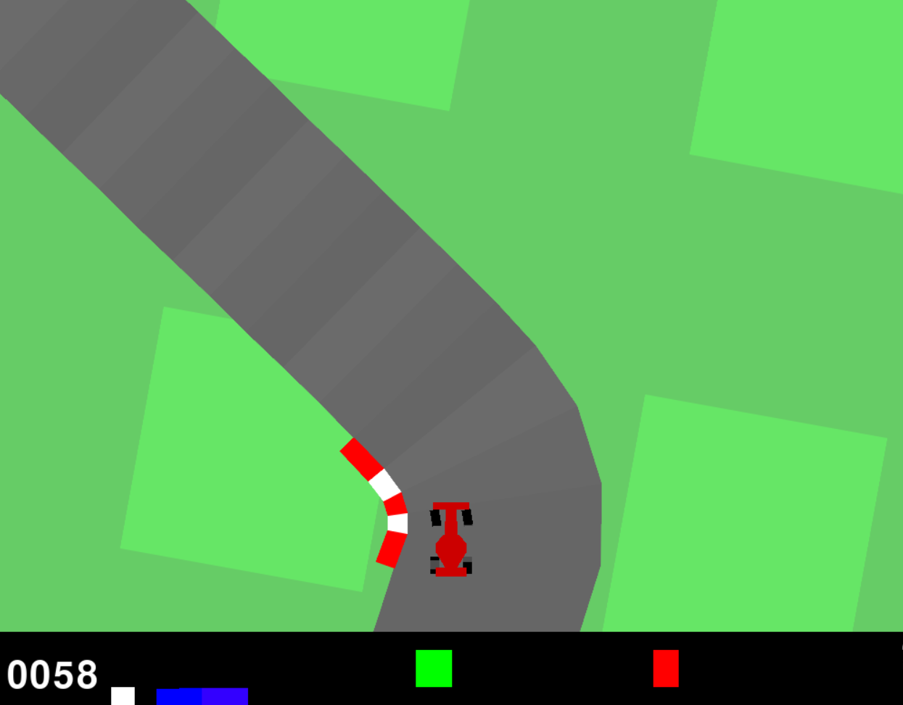
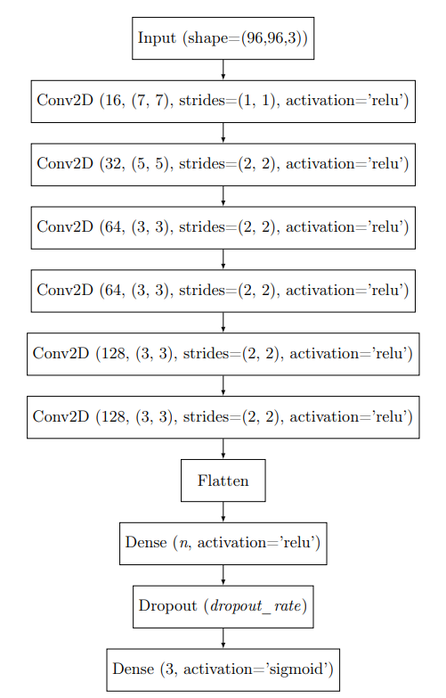
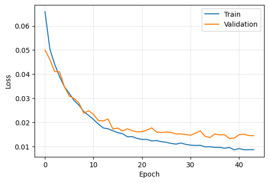
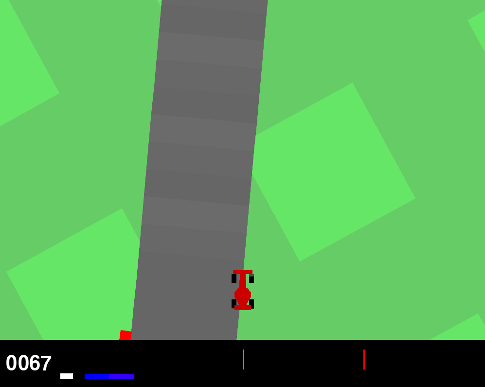
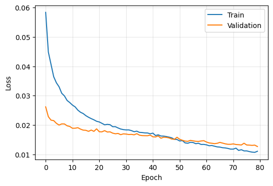

Behavioral Cloning with Car Racing
===================

This work consists of applying the concepts of behavioral cloning to train a neural network to play the Car Racing simulator.

## Car Racing
Car Racing is a racing simulation environment that offers a significant challenge for learning control from visual data (Figure 1). This environment involves controlling a vehicle from an aerial perspective on a racetrack whose design varies randomly with each attempt. The goal is to guide the vehicle around the track, completing laps while optimizing speed and avoiding going off the track.

Figure 1: Car Racing simulator interface

### Display
At the bottom of the screen, indicators such as vehicle speed, ABS sensor readings, steering wheel position, and gyroscope data are displayed.

### Action Space
There are two modes of action space: continuous and discrete. In the continuous action space, the player can control the direction (from -1, turning completely left, to +1, turning completely right), acceleration, and braking (ranging from 0 to 1). In the discrete action space, five actions are available: inactivity, turn left, turn right, accelerate, and brake. This work considers the continuous action space.

### Observation Space
The state of the environment is represented by a 3x96x96 pixel matrix (RGB), where the player receives visual information about the vehicle's position and the track structure.

### Rewards and Episode Termination
The reward is -0.1 for each frame of the game and +1000/N for each block visited, where N represents the total blocks of the track. For example, completing the race in 732 frames results in a reward of 1000 - 0.1*732 = 926.8 points.

The episode ends when all pieces are visited. The car can also go off the field, in which case it receives -100 in reward and dies.

## Simulation and Data Collection

### Simulation Environment Setup
The base code for Car Racing used is available at [Car Racing](https://github.com/openai/gym/blob/master/gym/envs/box2d/car_racing.py).

As per the instructions provided in the Car Racing Guide, the necessary libraries for running the code were installed, and the suggested modifications to the code were made, which are:

Choice of a fixed seed to always generate the same track, with a value of 1;
Use of noise for better training performance;
Attenuation of the car's controls by a factor of 0.25;
Saving trajectories to a pickle file.
Instructions for reproducing the developed code can be found in the README.md file of the project repository.

### Dataset Collection
Data collection was done by playing 15 games (laps). For each frame, the state, represented by an image, and the action taken, represented by a vector of 3 elements, are stored in lists and later exported to a pickle file.

The total amount of points generated was approximately 12,600 points, divided between training and testing at an 80/20 ratio.

Two preprocessing techniques were applied to prepare the data for model training. The first was normalizing the images to values between 0 and 1 for better model convergence. The second technique was normalizing the direction data, from -1 to 1 to 0 to 1, for later standardization of the activation functions of the model's output layer.

## Model Development

### Architecture
The neural network architecture of the agent follows the pattern provided in the Guide, as shown in Figure 2. The parameters n and dropout_rate were considered hyperparameters to be adjusted through experiments.

Figure 2: Agent neural network architecture

The loss function chosen was Mean Squared Error (MSE), given the continuous nature of the sigmoid function of the model's output, along with the Adam optimizer. To avoid overfitting, an early stopping function was used, whose criterion is the non-decrease of loss on the test set for 5 epochs. At the end of training, the best set of weights, defined by the lowest loss on the test set, is restored and applied to the model.

### Training
The model training was conducted by varying the following hyperparameters: number of neurons in the hidden Dense layer (n), dropout rate (d), and learning rate (lr). The batch size was set to 16. Table 1 shows the experiments conducted and the respective hyperparameter values.

| Exp. | n   | d   | lr    |
|------|-----|-----|-------|
| 1    | 16  | 0   | 0.0005|
| 2    | 16  | 0   | 0.01  |
| 3    | 16  | 0.2 | 0.0005|
| 4    | 16  | 0.2 | 0.01  |
| 5    | 64  | 0   | 0.0005|
| 6    | 64  | 0   | 0.01  |
| 7    | 64  | 0.2 | 0.0005|
| 8    | 64  | 0.2 | 0.01  |
| 9    | 256 | 0   | 0.0005|
| 10   | 256 | 0   | 0.01  |
| 11   | 256 | 0.2 | 0.0005|
| 12   | 256 | 0.2 | 0.01  |
Table 1: Combination of hyperparameters

The resulting models are 3.62, 3.69, and 3.99 MB, depending on the number of neurons in the hidden Dense layer. The small size of these models allows for execution on a CPU with reasonable performance and almost in real-time on the simulator, depending on the hardware configurations.

### Training Results
Table 2 shows the loss obtained on the test set for each experiment.

| Exp. | Loss   |
|------|--------|
| 1    | 0.01329|
| 2    | 0.01472|
| 3    | 0.01516|
| 4    | 0.03740|
| 5    | 0.01680|
| 6    | 0.01644|
| 7    | 0.01601|
| 8    | 0.02852|
| 9    | 0.01451|
| 10   | 0.01613|
| 11   | 0.01463|
| 12   | 0.01439|
Table 2: Loss results of the experiments

The combination of hyperparameters that led to the model with the lowest loss was experiment 1, with n = 16, d = 0, and lr = 0.0005. Generally, the final losses obtained did not vary significantly based on the tested hyperparameters, with most experiments generating well-fitted models, except for experiments 4 and 8.

Figure 3 shows the evolution of the loss function for the training and test 
sets during the training of the model obtained in experiment 1.

Figure 3: Cost function during the training of model 1

## Results in Simulated Environment
The trained models were submitted to the simulated environment to evaluate the reward obtained in the game. Table 3 shows the player's average reward over the 15 rounds used to extract training data and the average reward over 3 rounds for each model from the experiments.

| Exp.    | Score  | Loss   |
|---------|--------|--------|
| Player  | 915.74 | -      |
| 1       | 909.43 | 0.01329|
| 2       | 902.77 | 0.01472|
| 3       | 918.07 | 0.01516|
| 4       | 912.40 | 0.03740|
| 5       | 838.92 | 0.01680|
| 6       | 916.63 | 0.01644|
| 7       | 909.23 | 0.01601|
| 8       | 863.43 | 0.02852|
| 9       | 915.40 | 0.01451|
| 10      | 904.77 | 0.01613|
| 11      | 916.97 | 0.01463|
| 12      | 903.97 | 0.01439|
Table 3: Simulation results

It is noted that some of the trained models achieved scores higher than the player’s. This can be explained by the continuous output of the models, enabling smoother steering compared to the commands used by the player.

It is also observed that the models with the lowest training losses did not necessarily achieve the best scores in the game. Considering the scores, the best-performing model was from experiment 3.

### Behavioral Variation

A new experiment was conducted, this time using a different steering 
pattern for data collection. The pattern is to keep the center of the car 
on the right edge of the track, as shown in Figure 4.

Figure 4: Alternative driving behavior

The number of collected points this time was 5977, following the same 80/20 
train-test split of the dataset. The training hyperparameters adopted were 
n = 16, d = 0.2, and lr = 0.0001. Figure 5 shows the loss function for the training and test sets during the training of the model, with a final loss of 0.01271.

Figure 5: Loss function during training of the alternative model

Next, the model was used in the simulator, where it was found that the pattern followed reflects the pattern used in data collection.

### Track Variation
An additional test was conducted to evaluate the model’s performance on a track different from the one it was trained on, generated from another seed, number 10.

The average score obtained by model 3 over 3 laps on the track was 908.77, showing that the model is capable of controlling the car accurately not only in the same training environment but also on other tracks.

## Conclusion
This work applied behavioral cloning to train a neural network capable of playing the Car Racing simulator. The experiments involved data collection from the game, training models with different configurations, and evaluating performance under various conditions.

The results showed that the trained models could effectively control the car, even in situations not observed during training. This suggests that behavioral cloning is an efficient strategy for training agents in simulated environments.

## Repository Organization

- **main.py**: Script that contains the Car Racing simulation in both manual and model-controlled modes. It includes the following customizable variables:
  - manual: True enables manual control of the car. False enables model control;
  - save_datapoints: Flag to determine if datapoints should be saved at the end of the game;
  - save_Scores: Flag to determine if the score of each lap should be saved;
  - rounds: Number of laps per game;
  - model_path: Path to the trained model.

- **multi_training.ipynb**: Notebook containing the training of models in different experiments (combination of hyperparameters);
- **single_training.ipynb**: The same notebook, but for training the alternative behavior model;
- **dataset** folder: Contains pickle files composed of data collected from standard and alternative behavior training;
- **models** folder: Contains the 12 trained models from the experiments and the additional trained alternative behavior model;
- **scores** folder: Contains the saved scores of the player and each model.

- **model_3.mp4**: Video of model 3 controlling the car on the standard track;
- **model_alt.mp4**: Video of the alternative model controlling the car on the standard track;
- **model_3_seed10.mp4**: Video of model 3 controlling the car on a different track.

# Setup

1. Make sure you have Python 3.10 installed on your computer.
2. Clone the repository.
3. Install the project dependencies by running: pip install -r requirements.txt
4. Finally, use the "dvc pull" command to download the files versioned with DVC.